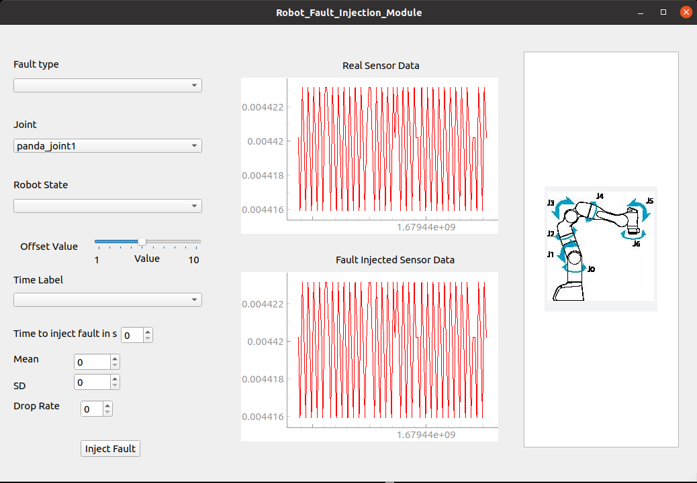

# Introduction

This project is a part of my Master Thesis at University of Stuttgart. 

This source code works as a environment playground for franka emika panda robot only, following steps depict quick start guide to setup the environment and run fault injection experiments. 

If you want to use Robot FI Tool to inject faults into different robot please follow [this](https://github.com/SHARATHbhushan/robot_fault_injector_block.git) repository 

## Package Structure

this section briefly explains the structure of the package and explains customizationa options and some important folders.

- data_vx: stores data for fault injection experiment
- devel: contains all the ROS build files
- install: ROS install directory
- plots_vx: stores plots generated fromm fault injection experiment
- src
  - [moveit tutorial](src/moveit_tutorials/): moveit controller code and configurations for panda robot
    - custom pick place code (editable version) please go through the ROS C++ design schematic before editing and building this file : [pick_place_fib.cpp](src/moveit_tutorials/doc/pick_place/src/pick_place_fib.cpp)
  - [panda gazebo](src/panda-gazebo/): panda robot package  to support gazebo simulation this package also houses seven piece puzzle environment
    - [resources](src/panda-gazebo/panda_gazebo/resources/): has all the required models and 7pp sdf for simulation
      - [models](src/panda-gazebo/panda_gazebo/resources/models/): add or remove models if wanted
      - [world](src/panda-gazebo/panda_gazebo/resources/worlds/): defines gazebo world the main world file used is [tangram.world](src/panda-gazebo/panda_gazebo/resources/worlds/tangram.world)
  - [robot_fi_tool](src/robot_fi_tool/): this package containes the fault injection module
    - [config](src/robot_fi_tool/config/): configuration files
    - [launch](src/robot_fi_tool/launch/): launch files
    - [msg](src/robot_fi_tool/msg/): custom message
    - [src](src/robot_fi_tool/src/): source code
    - [utils](src/robot_fi_tool/utils/): code for FI experiment
  

## Frontend

## Scenario

# Quick Start

## Requirements
- `sudo apt-get install qt5-default`
- `pip3 install -r requirements.txt`

## build

`catkin build -j4 -DCMAKE_BUILD_TYPE=Release -DFranka_DIR:PATH=~/libfranka/build`

## Start simulation

- `source devel/setup.bash`
- `roslaunch panda_gazebo put_robot_in_world.launch`

## Start FI Module and person sim

- `roslaunch robot_fi_tool fault_module.launch`
- to inject fault using GUI: `rosrun robot_fi_module fib_gui_v2.py`

or 

## Start random FI Process

- random planning and execution: `roslaunch robot_fi_tool rand_fault_injector.launch`
- random real-time: `roslaunch robot_fi_tool real_time_rand_fault_injection.launch`

## FI Experiment

- `bash pipiline.sh`

this starts random fault injection experiment and saves the bag files into data_v4

# Docker setup

The package is also supported with docker, we provide a docker image [here](https://hub.docker.com/r/sharathnataraj1304/panda_robot_fault_injection_framework), it is built with noetic ros docker image and this section shows how to setup the image and start the container, and run the graphics to support gazebo and rviz

- `docker pull sharathnataraj1304/panda_robot_fault_injection_framework:latest`

- `sudo xhost +si:localuser:root`

- `docker run --gpus all -e DISPLAY=$DISPLAY --env NVIDIA_VISIBLE_DEVICES=all --env NVIDIA_DRIVER_CAPABILITIES=all --env DISPLAY --env QT_X11_NO_MITSHM=1 -v /tmp/.X11-unix:/tmp/.X11-unix -v /dev:/dev --net=host --privileged -it sharathnataraj1304/panda_robot_fault_injection_framework:latest /bin/bash`

- `source /opt/ros/noetic/setup.bash`

- in the other terminal start roscore locally `source /opt/ros/noetic/setup.bash` and `roscore`

- test the topics within the docker - `rostopic list`

- `cd panda_fault_injection_block`

- `rm -r build/` and `rm -r devel/`

- `catkin build -j4 -DCMAKE_BUILD_TYPE=Release -DFranka_DIR:PATH=~/libfranka/build`

- `source devel/setup.bash`

- `bash docker_exec.sh`

